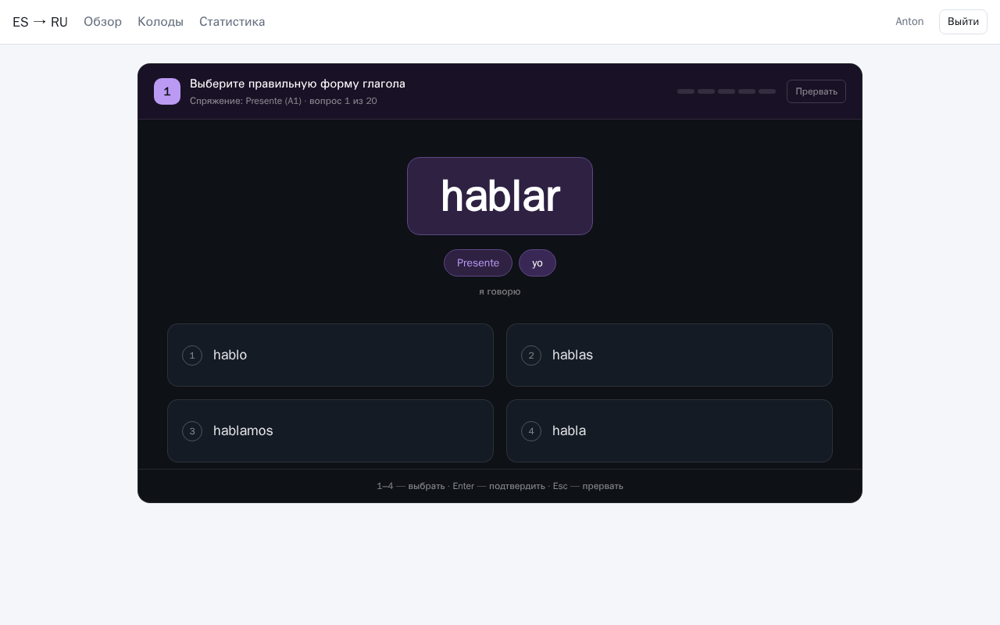
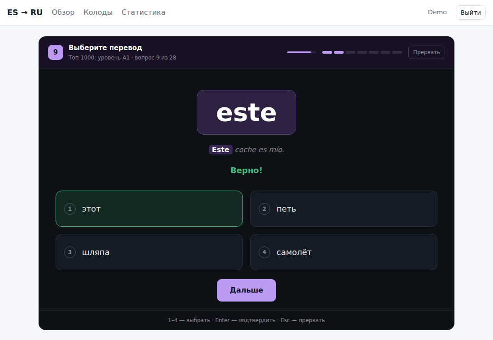
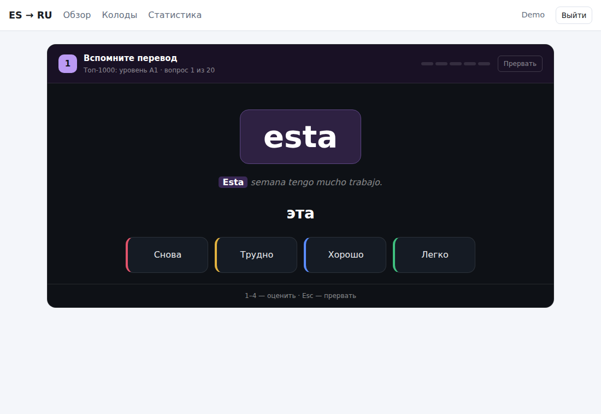
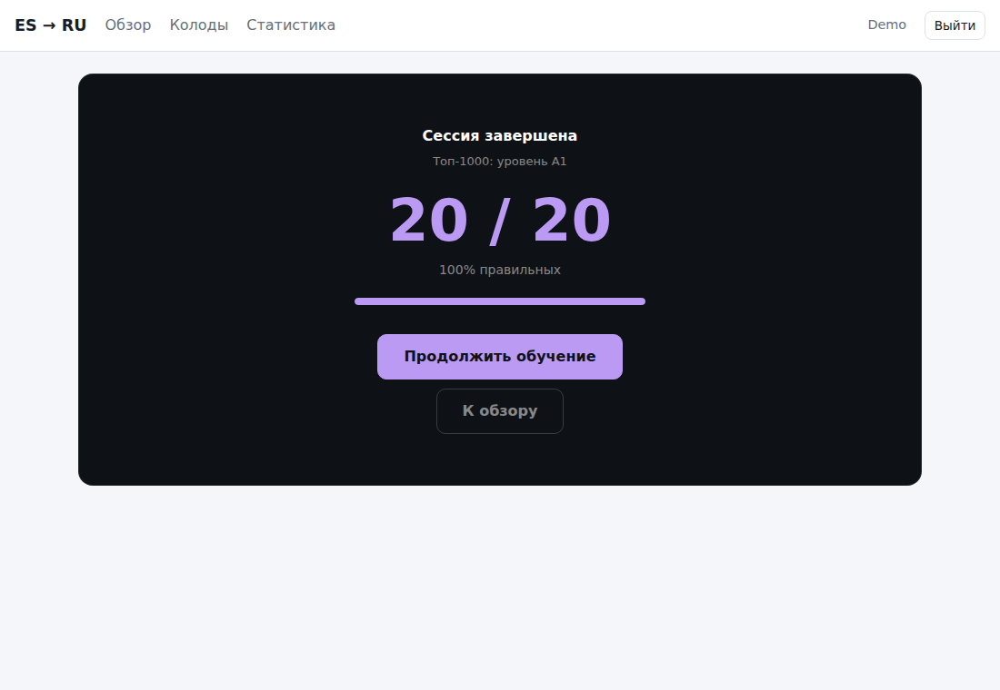
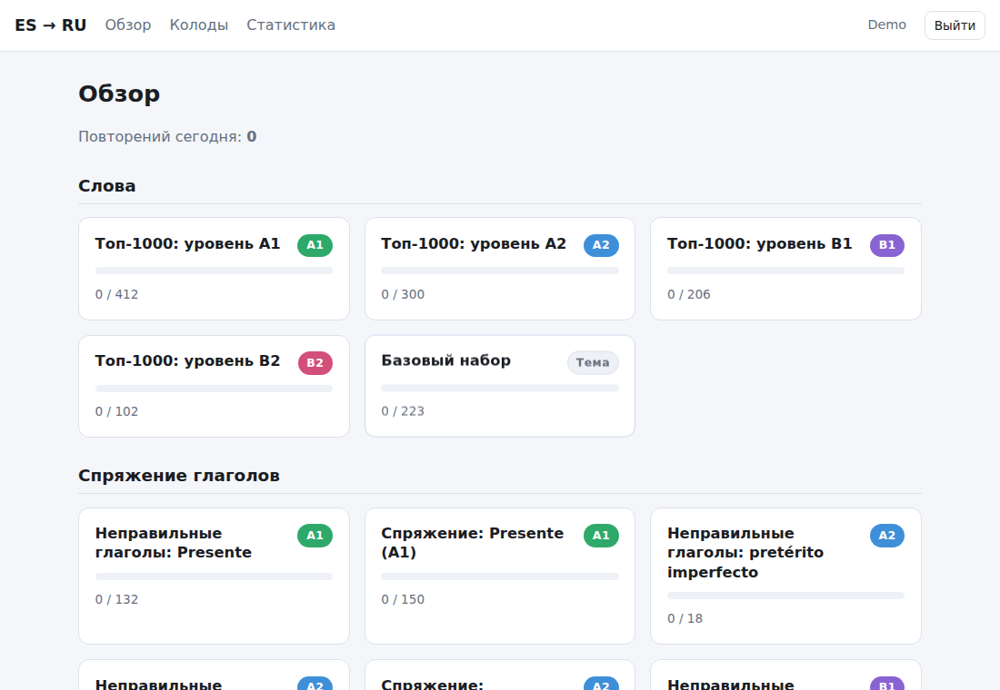
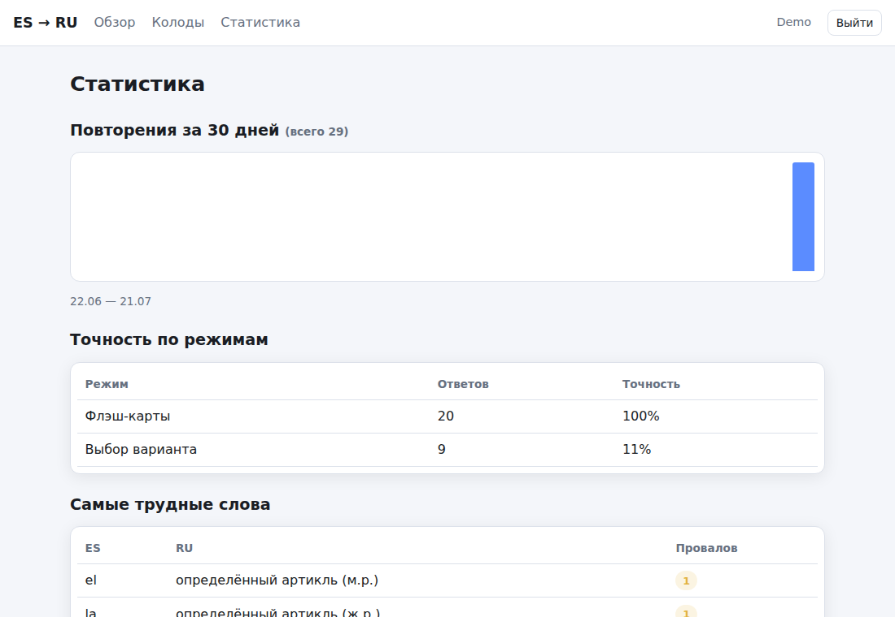

# quiz-language-learning

A local, self-hosted Spanish → Russian language trainer with SM-2 spaced repetition
(FastAPI + SQLAlchemy + SQLite, server-rendered UI with HTMX).

## Screenshots

| | |
| --- | --- |
|  |  |
| Multiple choice — a correct answer auto-advances after a short countdown (top-right of the header) | |
|  |  |
| Flashcards (self-graded) | Session summary — offers to continue if the deck has more due/unseen cards |
|  |  |
| Dashboard — progress per learning block | Stats — accuracy by mode, hardest words |

More screens (profile picker, block/mode selector) are in [`docs/screenshots/`](docs/screenshots/).

## Features

- **Learning blocks with CEFR levels (A1–B2)**: Top-1000 frequency words split by
  level, verb conjugation drills (presente → subjuntivo/imperativo), and
  "word in sentence" gap-fill exercises (ser/estar, por/para, subjunctive contrasts, …)
- **Study modes**: flashcards (self-graded), multiple choice, typed answer
  (typo-tolerant), match pairs — grammar blocks use choice/typed
- **Multiple local profiles** (Netflix-style picker, no passwords) with independent
  SM-2 progress per word and per exercise
- **Custom decks**: create your own, CSV import/export (`es,ru,example`)
- **Stats**: reviews per day, accuracy by mode, hardest words/exercises

## Data safety

This application must never move, rename, delete, or silently overwrite the
user's data file. The only operations permitted on the data file are:
reading/writing application data through normal use, and in-place Alembic
schema migrations. Any change to where or how data is stored must be
additive and backward-compatible — never a destructive default.

## Quick start (Docker)

```bash
docker compose up --build
```

The app is served at <http://localhost:8000>.

### User data is external to the container

All user data (profiles, progress, custom decks) lives in a single SQLite database
**outside** the image and is connected at container launch via a volume mount.
The default `docker-compose.yml` maps host `~/.quiz-language-learning` → container
`/data` (database file `/data/app.db`):

```yaml
volumes:
  - ${QUIZ_DATA_DIR:-${HOME}/.quiz-language-learning}:/data
```

Override the location with the `QUIZ_DATA_DIR` env var, e.g.
`QUIZ_DATA_DIR=/mnt/backups/quiz docker compose up`. Point it at any host path
or named volume to relocate the data.

The container self-heals ownership of `/data` on every start — the entrypoint
runs as root just long enough to `chown` the mount (which Docker may have
auto-created as root if it didn't already exist) before dropping privileges
to the app user. No manual `mkdir`/`chown` is ever required, regardless of
whether the host directory pre-existed, was deleted, or was freshly
auto-created by Docker.

Migrations run automatically on startup, so upgrading the image keeps existing data.

Back up by copying `app.db` from the data directory (stop the container first,
or also copy the `-wal`/`-shm` sidecar files).

**Upgrading from a version that used `./data/app.db`**: that path is no longer
read by default. Manually copy your existing data to the new location — this
is not done automatically, since automatic file moves are exactly the risk
the [Data safety](#data-safety) policy above guards against:

```bash
mkdir -p ~/.quiz-language-learning && cp ./data/app.db ~/.quiz-language-learning/
```

## Configuration

| Env var | Default | Meaning |
| --- | --- | --- |
| `DATABASE_PATH` | `/data/app.db` (in container); `~/.quiz-language-learning/app.db` (bare local dev) | SQLite file location |
| `QUIZ_DATA_DIR` | `~/.quiz-language-learning` | (docker-compose only) host directory bind-mounted to `/data` |
| `SESSION_SIZE` | `20` | Max cards per study session |
| `SEED_DIR` | `./seed` | Directory with `blocks.json` + content CSVs |

## Adding content

Vocab decks, conjugation drills, and gap-fill exercises are all plain CSV
under `seed/`, registered in `seed/blocks.json`. Adding a new block is a
content-only change — no code or migration needed. See
[`docs/content-authoring.md`](docs/content-authoring.md) for the manifest
format, the three CSV schemas (`vocab` / `tenses` / `gap`), and how to
validate a new file before shipping it.

## Local development

```bash
uv sync
uv run uvicorn app.main:app --reload   # migrations + seeding run on startup
```

Run the test suite:

```bash
uv run pytest
```

## CI / releases

- `ci.yml` — tests + Docker build check on every push/PR to `main`
- `auto-release.yml` — on every push to `main` that isn't docs-only: bumps
  the patch version (`vX.Y.Z` → `vX.Y.Z+1`, starting at `v0.1.0`), tags it,
  and runs `release.yml` against that tag
- `release.yml` — tests, image push to GHCR, GitHub Release. Triggered
  either by `auto-release.yml` or by manually pushing a `v*` tag (e.g. for a
  deliberate major/minor bump: `git tag v1.0.0 && git push origin v1.0.0`)
